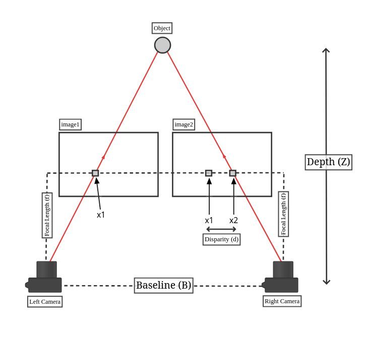

## Theory

### 1. How Humans See Depth — The Biological Inspiration

The human visual system uses two eyes placed a few centimetres apart to perceive depth. Each eye sees the same scene from a slightly different angle. When you hold a finger close to your face and alternately close each eye, the finger appears to shift position against the background. This shift is larger when the object is closer, and smaller when the object is farther away. The brain uses this difference to calculate how far away objects are. This natural ability is called **binocular vision**, and stereo camera systems are designed to replicate it mathematically.

### 2. What Is a Stereo Camera System?

A stereo camera consists of two cameras mounted side by side at a fixed, known horizontal distance called the **baseline (B)**. Both cameras look at the same scene simultaneously, each capturing a slightly different perspective of it. Just like the human eyes, each camera sees the same object at a slightly different horizontal position in its image. The goal is to find how much each point in the scene has shifted between the left and right camera images, and use that shift to calculate its depth.

 

### 3. What Is Disparity?

**Disparity (d)** is the horizontal difference in pixel position of the same scene point between the left and right camera images.

- If a point appears at pixel column 320 in the left image and pixel column 280 in the right image, the disparity is 40 pixels.
- Objects that are **close** to the camera shift a lot — they have **high disparity**.
- Objects that are **far** from the camera shift very little — they have **low disparity**.
- Objects at infinite distance show **zero disparity**.

This inverse relationship between disparity and distance is the core concept of stereo vision.

### 4. The Depth Formula

The relationship between disparity and depth is described by the following formula:

$$
Z = \frac{(f \times B)}{d}
$$

Where:
- **Z** = depth to the object in metres (the value we want to find)
- **f** = focal length of the camera in pixels (a property of the camera lens and sensor)
- **B** = baseline in metres (the physical horizontal separation between the two cameras)
- **d** = disparity in pixels (the horizontal pixel shift measured between the two images)

The formula has a few things worth noticing. Because **d** sits in the denominator, halving the disparity doubles the computed depth — the relationship is strictly inverse. Making the baseline wider pushes up the numerator, which means the system can tell apart objects at similar depths more reliably. Cranking up the focal length helps in the same way, though the trade-off is a narrower field of view.

### 5. 3D Point Reconstruction

Once depth Z is known for a pixel at position (u, v) in the image, its full 3D position in space can be computed using the back-projection equations:

$$
X = \frac{(u - c_x) \times Z}{f_x}
$$
$$
Y = \frac{(v - c_y) \times Z}{f_y}
$$

Where:
- **(u, v)** = pixel coordinates (column, row) in the image
- **($c_x$, $c_y$)** = principal point — the pixel at the centre of the image (optical axis)
- **$f_x$, $f_y$** = focal lengths in pixels along the horizontal and vertical axes

These equations convert every valid pixel in the depth map into a point in 3D space. Applying this to all pixels produces a **point cloud**.

### 6. Depth Uncertainty — Why Depth Accuracy Drops with Distance

The depth measurement is not perfectly accurate — it has uncertainty that grows with distance. The depth uncertainty formula is:

$$
\Delta Z = \frac{Z^2 \times \Delta d}{f \times B}
$$

This shows that depth error grows with the **square** of the distance Z. A point at 4 metres has 16 times the depth uncertainty of a point at 1 metre, under identical camera settings. This is why stereo cameras are reliable for close objects but become inaccurate at large distances.

### 7. What Is a Depth Map?

A **depth map** is a 2D image where each pixel stores the computed depth value Z instead of a colour. In visualisation, depth maps are usually displayed as colour-coded images where:
- **Warm colours** (red, orange) represent objects that are close to the camera.
- **Cool colours** (blue, green) represent objects that are farther away.
- **Black** pixels indicate regions where the disparity was too small or zero, making depth unmeasurable — known as the **stereo blind zone**.

### 8. The Stereo Blind Zone

When an object is too close to the camera, one camera may not be able to see it at all because it is blocked by the other camera's field of view. This creates a region near the camera where stereo matching is impossible, called the **stereo blind zone**. It appears as a black region on one side of the depth map.

Similarly, when objects are very far away, disparity drops to near zero (below 1 or 2 pixels), and the depth calculation becomes unreliable. This defines the **maximum reliable range** of a stereo camera.

### 9. Applications of Stereo Vision

Stereo vision is one of the most widely used 3D sensing technologies because it requires no special light source — only two cameras and computation. It is used in:
- **Autonomous vehicles** — detecting obstacles at short to medium range
- **Robotics** — helping a robot arm judge where to grab an object
- **Industrial inspection** — checking whether a machined surface matches spec
- **Augmented reality headsets** — anchoring virtual objects to real-world surfaces
- **Surgical robotics** — giving the surgeon a live depth view during keyhole procedures 
